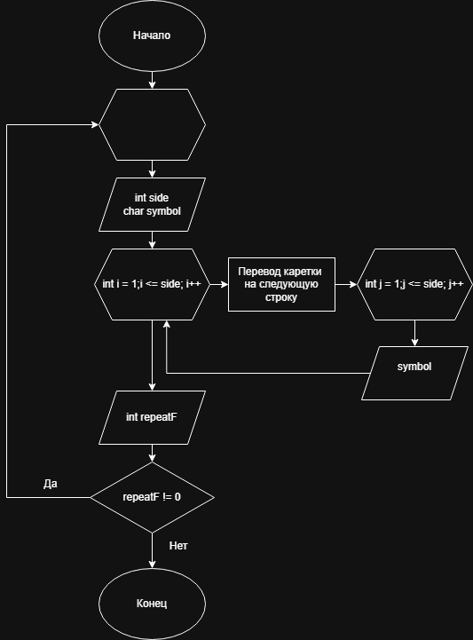

# Домашнее задание к работе 9

## Условие задачи
Написать программу, выводящую на экран заданную
геометрическую фигуру, нарисованную с помощью заданного с клавиатуры
символа, условие заполнения фигуры и задаваемые параметры фигуры в
таблице (остальные можно взять константные)
Квадрат
---
## 1. Алгоритм и блок схема

### Алгоритм
1. **Начало**
2. Объявить переменные:
   - `repeatF` - выбор повторения программы
   - `side` - сторона
   - `symbol` - печатаемый симбол
3. Запросить у пользователя side, symbol
4. В цикле `int i` от 1 до side (вкл)
    	a. Перевод каретки на новую строку;
      b. В цикле `int j` от 1 до side (вкл)
             Выводим `symbol`
6. Спросить у пользователя хочет ли он повторить, если да то к 3 пункту, иначе 7
7. **Конец**

### Блок-схема


 [Ссылка на блок-схему](https://viewer.diagrams.net/?tags=%7B%7D&lightbox=1&highlight=0000ff&edit=_blank&layers=1&nav=1&title=Lab9_schema.drawio&dark=auto#Uhttps%3A%2F%2Fdrive.google.com%2Fuc%3Fid%3D1i_8qfE62aDyNv1b-rcq080gaXy8P7hKS%26export%3Ddownload)

 ## 2. Реализация программы

```c
#include <locale.h>
#include <stdio.h>

int main()
{
	int repeatF, side;
	char symbol;

	setlocale(LC_ALL, "RUS");
	repeatF = 0;

	do
	{
		repeatF = 0;
		printf("Введите стору квадрата и символ через пробел: ");
		scanf("%d %c", &side, &symbol);

		for (int i = 1; i <= side; i++)
		{
			printf("\n");
			for (int j = 1; j <= side; j++)
				printf("%c",symbol);
		}
		printf("\nЖелаете повторить 0 - нет, иначе - да: ");
		scanf("%d", &repeatF);
	}
	while (repeatF);
	puts("");
	system("pause");
}
```
# 3. Результаты работы программы
Введите стору квадрата и символ через пробел: 5 a

aaaaa
aaaaa
aaaaa
aaaaa
aaaaa
Желаете повторить 0 - нет, иначе - да: 1
Введите стору квадрата и символ через пробел: 6 /

//////
//////
//////
//////
//////
//////
Желаете повторить 0 - нет, иначе - да: 0

Для продолжения нажмите любую клавишу . . .

# 4. Информация о разработчике
Авраменко Дмитрий бИПТ-251
